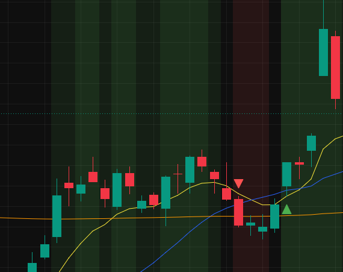
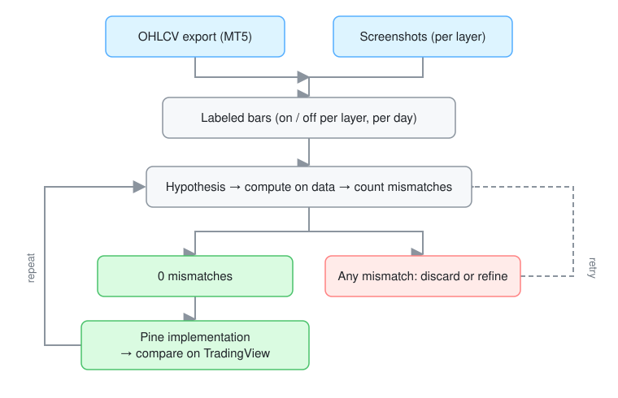

# Trend + Pullbacks: a Moving-Average Confluence Study

A Pine Script v6 study of a trend-following and pullback setup, built from three moving averages and multi-timeframe agreement, and prepared for systematic backtesting on B3 stocks.

> Personal research project, for study purposes only. It is not a signal service, it does not execute orders, and nothing here is financial advice.

<p align="center">
  
</p>

## Problem

Discretionary trend-following setups are hard to test because they live on a chart, not in code. I wanted a version that could be backtested, and I wanted to know exactly which rules drive it.

The rules were not documented, so I rebuilt them by observation. I measured the visible behavior of an existing closed-source indicator on B3 data and tested hypotheses against it, one bar at a time. No code was decompiled and no protection was bypassed. The question this project answers is: **what is the smallest rule set that reproduces what the chart shows, and can I prove it bar by bar?**

## What it does today

### Implemented

- EMA 9, SMA 20 and SMA 200 on the chart.
- Layer 1 background: price above all three averages (green) or below all three (red).
- Layer 2 background: layer 1, with the 4h, daily and weekly trends in agreement. It is drawn as a second overlay, so the two stack into a darker tint.
- Pullback arrows (up and down) with optional alerts.
- A debug pane that plots each timeframe's trend as its own row, used to find layer 2.

### In progress

- Side-by-side bar-by-bar comparison of layer 2 on BBAS3 and PETR4.
- A backtest of the arrows (see [Roadmap](#roadmap)).

### Not implemented

- Order execution or broker integration.
- Position sizing, slippage and cost modeling.
- Trading signals or recommendations.

## Rules

| Piece | Rule |
|---|---|
| Uptrend | `close > EMA9` and `close > SMA20` and `close > SMA200` |
| Downtrend | `close < EMA9` and `close < SMA20` and `close < SMA200` |
| Pullback up | Uptrend now, and the previous close was below the previous SMA20 |
| Pullback down | Downtrend now, and the previous close was above the previous SMA20 |
| Layer 2 | Uptrend (or downtrend) on the 4h, daily and weekly timeframes at the same time |

The study has no tunable lengths on purpose. Its output depends only on the current chart's candles.

## Method

<p align="center">
  
</p>

1. Export daily OHLCV from MT5 for three tickers.
2. Turn each layer of the target chart on by itself and read the background of every bar from the screenshots (pixel sampling at the gap beside each bar).
3. Express each hypothesis as code and count the bars where it disagrees with the labels.
4. Keep a rule only when it explains every labeled bar, then test it on other tickers.

## Engineering highlights

- **Falsification over curve fitting.** Every rule was scored by the number of wrong bars. A single contradicting bar was enough to throw a hypothesis out.
- **No external inputs.** The output depends only on the current chart's candles and the three averages. It runs on any symbol or timeframe.
- **A traceable record of failures.** The dead ends below are kept on purpose, so the final rule set is justified by what was ruled out.

## Findings

1. **Layer 1 is exact.** The red side needs `close < SMA200`. An early version without it produced false red bars.
2. **The arrows have two equivalent forms.** "Trend AND previous close on the other side of SMA20" gives the same bars as "trend AND SMA20 cross on this bar". The simpler one is used.
3. **There is no strong/weak grade.** The darker look is two separate 90%-transparent layers stacking on the same bar.
4. **Layer 2 is multi-timeframe confluence** (4h, daily and weekly).
5. **A Pine v6 short-circuit bug hid layer 2** (below).

### Dead ends for layer 2

Each of these was tested against labeled bars and rejected:

| Idea | Result |
|---|---|
| Price and moving-average conjunctions (up to 4 conditions, lags up to 4) | No fit |
| Other price sources (HL2, HLC3, OHLC4) | No fit |
| Ordering of the three averages | Not sufficient |
| EMA9 slope | Necessary but not sufficient |
| Supertrend | No fit |
| RSI, ADX/DI, efficiency ratio, R-squared, choppiness | No fit |
| Volume against its average | No fit |
| Weekday or month effects | No fit |
| Weekly trend alone | No fit |
| 15/30/60/120-minute trends | No fit |

## A Pine v6 trap: `and` short-circuits

In Pine v6, `a and b` does not evaluate `b` when `a` is false. If `b` contains a `ta.*` call, that call is skipped on those bars, so the indicator's internal history has gaps and the average is silently wrong.

My first multi-timeframe version looked fine, but the weekly trend never turned on:

```pine
// Wrong: ta.sma(close, 200) is skipped whenever an earlier test is false
f_up() => close > ta.ema(close, 9) and close > ta.sma(close, 20) and close > ta.sma(close, 200)
```

```pine
// Right: every ta.* value is computed on every bar, then compared
f_up() =>
    e = ta.ema(close, 9)
    s = ta.sma(close, 20)
    m = ta.sma(close, 200)
    close > e and close > s and close > m
```

The editor flags this with a "function should be called on each calculation" warning. I had the warning on screen for a while before reading it properly. It is also why my earlier conclusion that "no timeframe matches layer 2" was wrong.

## Selected engineering decisions

### Fixed lengths, no inputs
**Context.** The original has no parameters.
**Decision.** The study exposes only visibility toggles.
**Consequence.** There is nothing to overfit, and any backtest result is about a fixed rule, not a tuned one.

### Layer 2 as a separate overlay, not a "strong" state
**Context.** The darker tint looked like a second intensity level.
**Decision.** Model it as an independent condition drawn as its own layer.
**Consequence.** It matches the stacked-transparency look exactly, and it can be switched off on its own.

### Arrows do not depend on layer 2
**Context.** `request.security()` on higher timeframes repaints on the live bar.
**Decision.** The arrow rule uses only the chart's own bars.
**Consequence.** The arrows are safe to backtest. Layer 2 is a filter to test separately.

## Validation

- Layer 1 and the arrows were checked against labeled daily bars on BBAS3, PETR4 and USIM3.
- Layer 2 was checked by plotting each timeframe's trend in a separate pane and comparing it with the target's dark bands on USIM3.
- Automated tests: none yet. A Python cross-check of the rules on raw OHLCV is on the roadmap.

## Current limitations

- Data differs between MT5 and TradingView (dividend adjustment, 4h bar construction). Bars whose close is within a cent or two of an average can flip.
- Layer 2 was verified on daily charts only.
- Weekly values with lookahead off only update on the last bar of the week for historical data, and repaint on the live bar.
- The weekly SMA200 needs about 200 weekly bars. Short histories keep layer 2 off.
- Historical results do not imply future results.

## Roadmap

- [ ] Define the trade rules precisely: signal on close, entry on breakout of the signal bar, stop at the signal bar's extreme, targets from Fibonacci extensions.
- [ ] Implement them as a Pine `strategy()` and as an independent Python backtest, and compare the two.
- [ ] Model B3 costs, lot size and slippage. Use adjusted and unadjusted prices and report both.
- [ ] Run an ablation: arrows alone, arrows with layer 2 as a filter, arrows with the weekly trend only.
- [ ] Split the sample in time (in-sample and out-of-sample) and expand the ticker universe.
- [ ] Report drawdown, win rate, expectancy and the number of trades, and flag any result that depends on a handful of trades.

## Development approach

This project was developed with AI assistance. AI tools helped with hypothesis testing, data analysis scripts, code and documentation. The research questions, constraints, validation against the charts, the decisions above and final acceptance remain my responsibility.

## Using it

1. Open the Pine Editor on TradingView.
2. Paste `src/trend_pullback_study.pine` and click **Add to chart**.
3. Use a daily chart of a B3 stock. The layer-2 comparison was done on daily bars.

## License

MIT (see `LICENSE`).

## Disclaimer

For education and research only. Past performance does not guarantee future results. Trading involves risk of loss.
